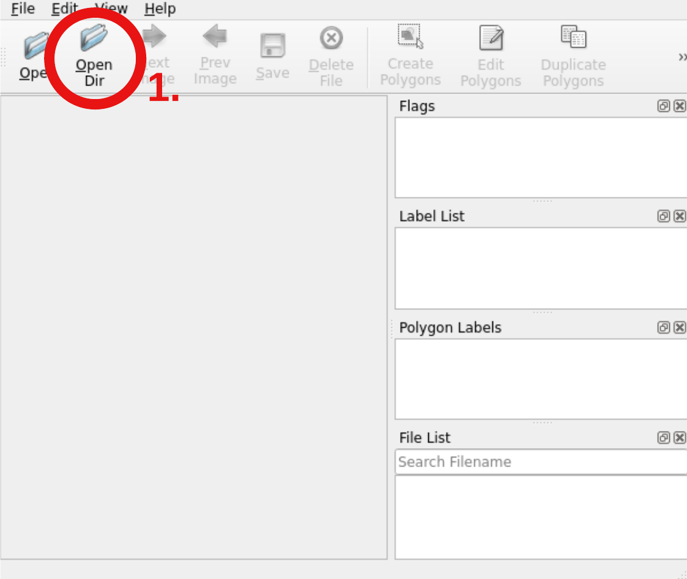
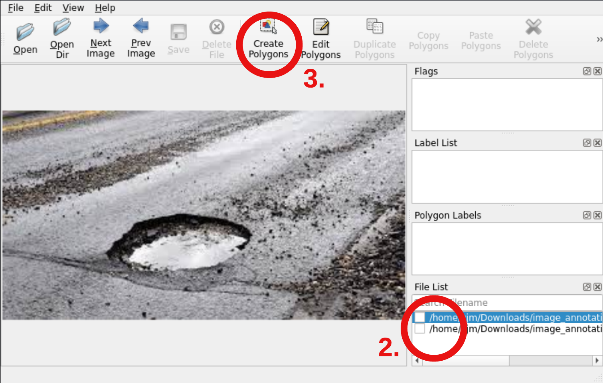
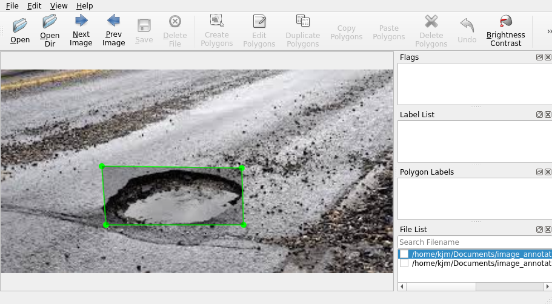
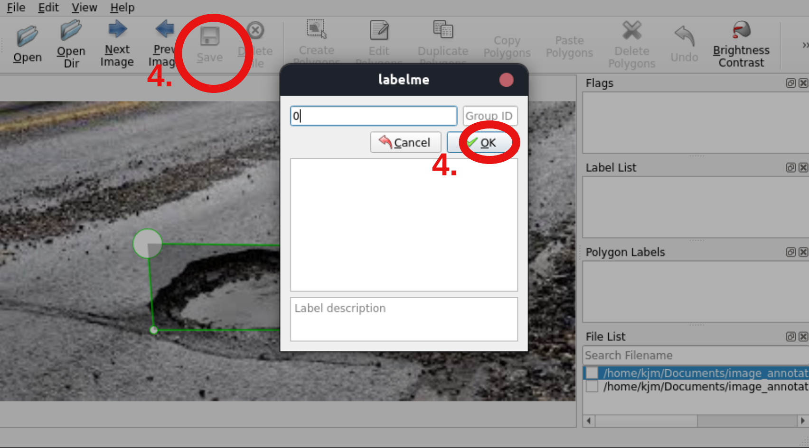

# Image Annotation Tool guidelines

Labelme คือ annotation tool อย่างหนึ่งที่ใช้ในการ annotate รูปภาพมาใช้ในการทำ object dection 
รายละเอียดเพิ่มเติมสามารถดูเพิ่มเติมได้ที่  https://github.com/wkentaro/labelme

Labelme2YOLO คือ script ที่เอาไว้ใช้ในการแปลงไฟล์ **JSON** จาก Labelme ให้ไปอยู่ใน format ของ **YOLO** เพื่อใช้ในการ train model
รายละเอียดเพิ่มเติมสามารถดูเพิ่มเติมได้ที่  https://github.com/rooneysh/Labelme2YOLO


### 1. ติดตั้ง Packages ที่จำเป็น

ภายใน `requirements.txt` จะประกอบไปด้วย package ที่จำเป็นสำหรับ `Labelme` และ `labelme2YOLO` 
**(เราไม่สามารถใช้ `pip install labelme2yolo` ตรง ๆ ได้ เนื่องจาก opencv ใน labelme2yolo เป็น version ที่ไม่รองรับกับ labelme)**

`pip install -r requirements.txt`

### 2. Download รูปภาพ
Download รูปภาพ และในไปใส่ภายในโฟลเดอร์ที่เราสร้าง ซึ่งในกรณีนี้ คือ **pothole_images** 
ไฟล์รูปภาพสามารถเป็น **jpeg**, **png**, หรือ **jpg** format ก็ได้.
```bash
Current_dir
├── Labelme2YOLO
│   ├── labelme2yolo.py
│   ├── README.md
│   └── requirements-labelme2yolo.txt
├── README.md
├── requirements.txt
├── pothole_images
│   ├── pothole_img1.png
│   ├── pothole_img2.jpg
│   └── pothole_img3.jpeg

            .
            .
            .
``` 
### 3. ทำการ annotate รูปภาพ 
tool หลักที่เราจะใช้คือ Labelme ซึ่งเราสามารถเปิดได้โดยการรันคำสั่ง labelme ใน terminal
```bash
labelme 
```
1. ทำการเลือก folder ที่เราดาวน์โหลดรูปภาพใส่เอาไว้




2. Tool จะทำการ import รูปภาพมาให้เรา โดยในตัวอย่างเรามีอยู่ 2 รูป

3. ทำการลากเส้นเป็นกล่องสี่เหลี่ยม ให้ครอบบริเวณหลุมให้ได้เล็กที่สุด 





4. เมื่อเราลากเส้นมาบรรจบที่จุดเริ่มต้น จะมีกล้องขึ้นมาให้เรา label ซึ่งในกรณีนี้ เรา label หลุมให้เป็นเลข 0 จากนั้นเมื่อเรากด **ok** ให้เรา save ไฟล์ข้อมูลของกล่องและรูปภาพ ซึ่งอยู่ในรูปแบบของ **JSON**



5. ทำเช่นเดียวกันกับรูปที่ 2 ซึ่งเมื่อเราทำเสร็จแล้ว เราสามารถกดปิด tool ได้เลย

### 4. ทำการแปลงไฟล์ JSON ไปเป็น YOLO
เนื่องจากเราต้องการให้ไฟล์ที่เรา annotate อยู่ในรูปแบบของ **YOLO** format เพื่อใช้ในการ train model เราจึงต้องทำการแปลงไฟล์ **JSON** ไปเป็น **YOLO** 

เราสามารถทำการแปลงไฟล์ได้โดยการ run script ดังตัวอย่าง val_size คืออัตราส่วนของรูปที่เราต้องการนำมาใช้เป็น validation set
```bash
python ./Labelme2YOLO/labelme2yolo.py --json_dir ./pothole_images --val_size 0.2
```
เมื่อ run แล้ว script จะทำการสร้างโฟลเดอร์ YOLODataset ขึ้นมาเป็นอันเสร็จสิ้น
 ภายในโฟลเดอร์จะประกอบไปด้วย **images**, **labels** และ **dataset.yaml** ซึ่งเราจะใช้เพียงแค่ **images** และ **labels** เท่านั้นในกรณีนี้


